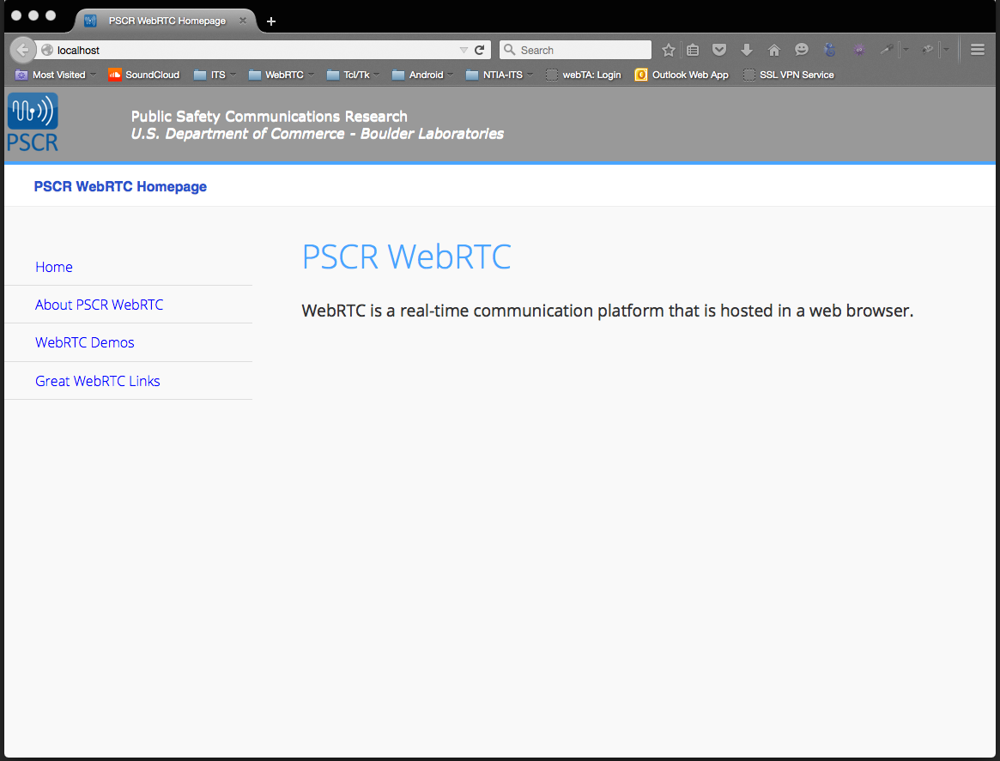
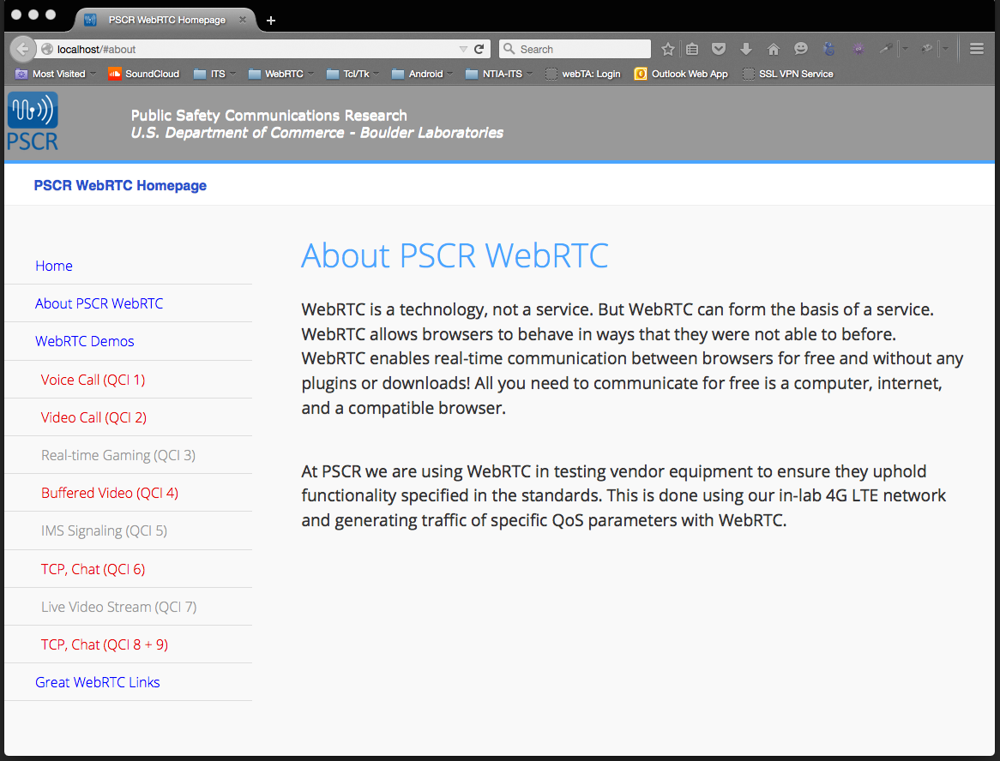
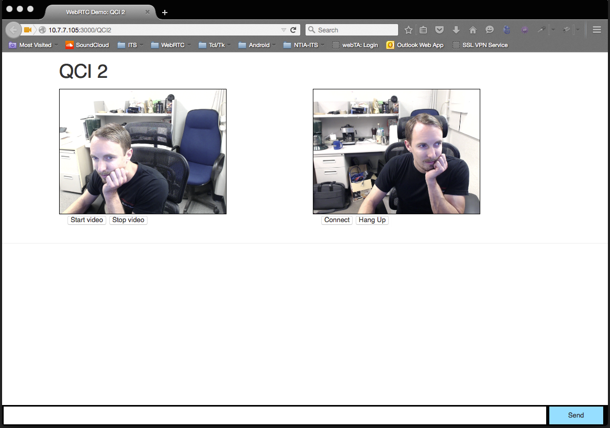

# webrtc-4-qos
**WebRTC code used for Public Safety Communications Research**

[WebRTC](http://www.webrtc.org/) is a technology, not a service. But WebRTC can form the basis of a service. WebRTC allows browsers to behave in ways that they were not able to before. WebRTC enables real-time communication between browsers for free and without any plugins or downloads! All you need to communicate for free is a computer, internet, and a compatible browser.

At [PSCR](http://www.pscr.gov/index.htm) we are using WebRTC in testing vendor equipment to ensure they uphold functionality specified in the standards. This is done using our in-lab 4G LTE network and generating traffic of specific QoS parameters with WebRTC. 

## Getting Started
I will describe the setup of my development environment on OSX:

1. Download the .zip or clone this repository onto your local machine.
2. Set up the Apache server on your Mac, here is what I used: [Apache server setup for OSX](http://getgrav.org/blog/mac-os-x-apache-setup-multiple-php-versions)
3. Go to where you downloaded or cloned the code. Open the Terminal and `cd` into the `webrtc-4-qos` directory, then select all the files and folders in this directory, copy them and then paste directly into the `Sites` folder you created when setting up the Apache server. If you `cd` into the `Sites` folder you should see `index.html`, `serve_index.js`, `twoWayVideoWithChat.html`, `_assets` folder, `css` folder etc.
4. Download [Node.js](https://nodejs.org/).
5. `cd` into your `Sites` folder and type: 
   + >`npm install socket.io`
   + `npm install node-static`
   + `npm install websocket`
   + `npm install express`
   

## Run The Code
**Prerequisite:** Before the code can be run, you must open `index.html`, `serve_index.js`, `twoWayAudioWithChat.html`, and `twoWayVideoWithChat.html` to change the host IP address to the IP of your local machine. At the top of the prior mentioned files there are comments that will tell you how many places in that file that you need to change IP addresses. The example code below is from `index.html` which tells you there are 5 places in that file where the IP address needs to be changed. And all spots will be denoted by this style of comment block:

```html
<!-- \/\/\/\/\/\/\/\/\/\/\/\/\/\/\/\/\/\/\/\/\/\/\/\/\/\/\/\/\/\/\/\/\/\/\/\/\/\/
PUT YOUR IP ADDRESS IN PLACE OF '10.10.10.10' -->
<li data-filtertext=""><a href="http://10.10.10.10:3000/QCI1" class="contentUpdate" style="color:#E60000">Voice Call (QCI 1)</a></li>
<li data-filtertext=""><a href="http://10.10.10.10:3000/QCI2" class="contentUpdate" style="color:#E60000">Video Call (QCI 2)</a></li>
<li data-filtertext=""><a href="#QCI3" class="contentUpdate" style="">Real-time Gaming (QCI 3)</a></li>
<li data-filtertext=""><a href="http://10.10.10.10:3000/QCI4" class="contentUpdate" style="color:#E60000">Buffered Video (QCI 4)</a></li>
<li data-filtertext=""><a href="#QCI5" class="contentUpdate" style="">IMS Signaling (QCI 5)</a></li>
<li data-filtertext=""><a href="http://10.10.10.10:3000/QCI6" class="contentUpdate" style="color:#E60000">TCP, Chat (QCI 6)</a></li>
<li data-filtertext=""><a href="#QCI7" class="contentUpdate" style="">Live Video Stream (QCI 7)</a></li>
<li data-filtertext=""><a href="http://10.10.10.10:3000/QCI6" class="contentUpdate" style="color:#E60000">TCP, Chat (QCI 8 + 9)</a></li>
<!-- ^^^^^^^^^^^^^^^^^^^^^^^^^^^^^^^^^^^^^^^^^^^^^^^^^^^^^^^^^^^^^^^^^^^^^^^^^^^^ -->
```

**Once the IP addresses have been changed...**
Open the Terminal and `cd` into the `Sites` folder.

1. Start the Apache server by typing: `sudo apachectl start`
2. Open a new tab or window for the Terminal, `cd` into the `Sites` folder and type: `node serve_index.js`
3. Open your browser (preferably Chrome or Firefox) and type `localhost` in the url bar at the top.
4. Explore the webpage and click on the **WebRTC Demos** tab and pick a demo!
5. Learn and Enjoy!

We now have Apache serving the main index page and Node will be serving all the WebRTC pages and signaling.
   + Don't forget to kill the servers when you are done. Type `sudo apachectl stop` to kill the Apache server, and type **Ctrl-C** to kill the node server.
   
## What It Should Look Like
   + After Apache is serving the main index page, if you type `localhost` in the url bar of Chrome or Firefox you should see the following page displayed:



   + Navigate around the page to the `WebRTC Demos` tab:



   + After typing `node serve_index.js` and the node server is listening on port 3000 (or whatever port you set it to), then the signaling is occuring for WebRTC to make the connections. So now you can click on one of the demo links which will take you to a different page where you can choose to share your webcam and/or microphone and then connect to a peer by sharing the exact url. Only difference is where the host can say `localhost`, when you share the url link, you must replace `localhost` with the hosts IP address. The screen shot below is taken from the peer's browser joining the host. Notice in the peer's url bar `localhost` is replaced by the hosts IP address.


